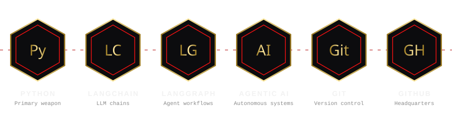
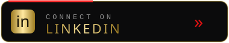
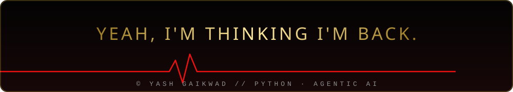

<table>
<tr>
<td width="170" align="center"></td>
<td>

**I.** No bug shall pass. 
**II.** Commit early. Commit often. 
**III.** Never leave a mission unfinished. 
**IV.** Always keep learning.

</td>
</tr>
</table>

  

